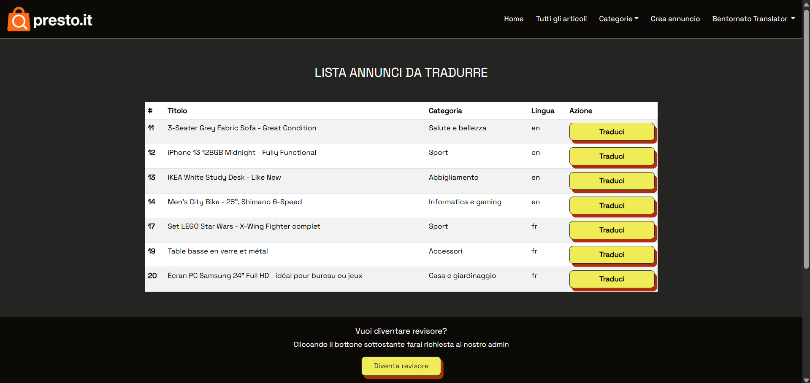

📢 Sito di Annunci – Laravel 12
Un'applicazione web per la pubblicazione e moderazione di annunci, sviluppata con Laravel 12, Google Vision API, Bootstrap e altri strumenti moderni.

## 🚀 Funzionalità principali
Homepage: Mostra gli ultimi annunci pubblicati e approvati.

Navigazione semplice tramite navbar con accesso a:

Login / Registrazione

Tutti gli annunci

Categorie

Dashboard personale (Utente loggato o zona Revisore o zona Traduttore)

Selezione lingua (italiano, Inglese, Francese)

## Autenticazione
Sistema di login e registrazione tramite Laravel Fortify.

## Pubblicazione Annunci
Accessibile solo agli utenti loggati, mediante form.
Un annuncio comprende:

Titolo

Descrizione

Prezzo

Categoria

Immagini (con possibilità di cancellarle in anteprima)

Immagini:

Croppate e ridimensionate con regole di validazione

Preview immediata prima della pubblicazione

Gli annunci vanno in revisione prima di essere visibili pubblicamente.

## Revisione Annunci
Gli utenti possono diventare revisori tramite un pulsante nel footer.
Questo genera una richiesta via email per abilitare il ruolo.

I revisori accedono a una dashboard da cui possono:

Approvare o rifiutare annunci

Vedere il contenuto analizzato delle immagini grazie alle Google Vision API

Rilevare contenuti sensibili: adult, violence, medical, ecc., rappresentati con icone Bootstrap

## Elaborazione immagini (Vision API + Imagick)
Rilevamento di volti nelle immagini

I volti vengono censurati automaticamente con emoji smile 😊

Aggiunta di watermark alle immagini pubblicate

## Ricerca Avanzata
Ricerca full-text degli annunci tramite barra di ricerca.

## 🛠️ Stack Tecnologico
Framework: Laravel 12

Frontend: Bootstrap 5

Autenticazione: Laravel Fortify

Image Processing: Imagick

Controllo contenuti immagini: Google Vision API

## Screenshot
### Tutti gli annunci

### Zona Revisore

### Zona Revisore-rating immagini

### Zona Traduttore

